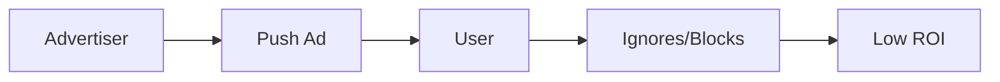
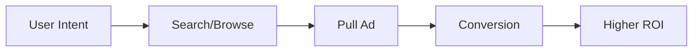
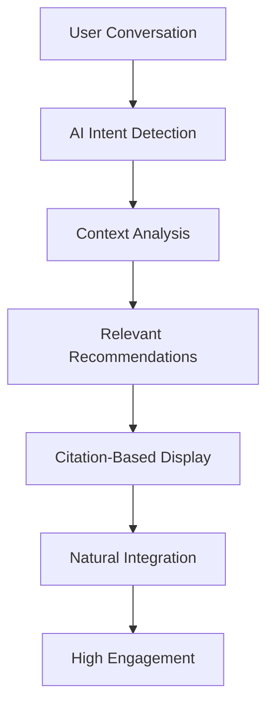

# AdMesh Ad Formats

Learn about AdMesh's unique approach to advertising through conversational, citation-based, and contextual ad formats that differ fundamentally from traditional push/pull advertising models.

## 🔄 Push vs Pull vs AdMesh's Contextual Model

### Traditional Push Advertising
**Definition**: Ads are forced upon users regardless of their current context or intent.

**Examples**:
- Banner ads on websites
- Pop-up advertisements
- TV commercials
- Social media sponsored posts

**Problems**:
- Interrupts user experience
- Often irrelevant to current context
- Creates ad fatigue
- Low engagement rates
- Users develop "banner blindness"



### Traditional Pull Advertising
**Definition**: Users actively seek out advertising content when they're ready to make a purchase.

**Examples**:
- Google search ads
- Product comparison sites
- Shopping platforms
- Review websites

**Problems**:
- Only captures users at bottom of funnel
- High competition and costs
- Misses discovery opportunities
- Limited to explicit search intent



### AdMesh's Contextual Intelligence Model
**Definition**: AI-powered recommendations that appear naturally within conversations and content when contextually relevant.

**Key Principles**:
- **Context-Aware**: Understands conversation flow and user intent
- **Non-Intrusive**: Appears as helpful suggestions, not ads
- **Intelligent Timing**: Shows recommendations at optimal moments
- **Citation-Based**: References products like academic sources
- **Value-First**: Provides genuine value before monetization



## 🎨 AdMesh Ad Formats

### 1. Citation-Based Recommendations

Display recommendations as numbered references within conversational text, similar to academic papers.

```tsx
import { AdMeshCitationUnit } from 'admesh-ui-sdk';

<AdMeshCitationUnit
  recommendations={recommendations}
  conversationText="For your startup's CRM needs, I recommend HubSpot for its excellent free tier and Salesforce for enterprise features..."
  citationStyle="numbered"
  showCitationList={true}
/>
```

**Output**:
```
For your startup's CRM needs, I recommend HubSpot¹ for its excellent 
free tier and Salesforce² for enterprise features...

References:
¹ HubSpot CRM - Free tier with excellent startup features
² Salesforce - Enterprise-grade CRM with advanced automation
```

### 2. Conversational Recommendations

Recommendations that appear naturally within chat interfaces and AI conversations.

```tsx
import { AdMeshConversationalUnit } from 'admesh-ui-sdk';

<AdMeshConversationalUnit
  recommendations={recommendations}
  config={{
    displayMode: 'inline',
    context: 'chat',
    maxRecommendations: 3,
    showPoweredBy: true
  }}
/>
```

### 3. Auto-Triggered Suggestions

Proactive recommendations that appear based on conversation context without explicit user requests.

```tsx
import { AdMeshAutoRecommendationWidget } from 'admesh-ui-sdk';

<AdMeshAutoRecommendationWidget
  recommendations={recommendations}
  trigger="User mentioned project management challenges"
  autoShow={true}
  position="bottom-right"
/>
```

### 4. Sidebar Recommendations

Persistent recommendation panels that complement main content without interrupting it.

```tsx
import { AdMeshSidebar } from 'admesh-ui-sdk';

<AdMeshSidebar
  recommendations={recommendations}
  config={{
    position: 'right',
    displayMode: 'recommendations',
    collapsible: true
  }}
/>
```

## 🧠 How AdMesh is Different

### Traditional Advertising Platforms

| Aspect | Traditional Push | Traditional Pull | AdMesh Contextual |
|--------|------------------|------------------|-------------------|
| **Timing** | Interrupts user flow | User-initiated only | Context-triggered |
| **Relevance** | Often irrelevant | High intent match | AI-determined relevance |
| **User Experience** | Disruptive | Expected | Enhancing |
| **Integration** | Separate from content | Search-based | Native to conversation |
| **Intelligence** | Rule-based targeting | Keyword matching | AI intent detection |
| **Format** | Banner/display ads | Search results | Citation references |

### AdMesh's Unique Advantages

#### 🎯 **Intent Detection Without Explicit Search**
```python
# Traditional: User must search "best CRM software"
# AdMesh: Detects intent from conversation

user_message = "I'm struggling to keep track of my customers"
# AdMesh AI detects CRM intent and suggests relevant tools
```

#### 📚 **Academic-Style Citations**
```
Traditional Ad: [🚨 BUY HUBSPOT NOW! 50% OFF! 🚨]

AdMesh Citation: "For customer management, consider HubSpot¹ 
for its user-friendly interface..."

¹ HubSpot CRM - Intuitive customer management platform
```

#### 🤖 **AI-Native Integration**
```tsx
// Seamlessly integrates with AI applications
function AIAssistant() {
  const handleUserQuery = async (query) => {
    const aiResponse = await getAIResponse(query);
    const recommendations = await getAdMeshRecommendations(query);
    
    return (
      <div>
        <AIResponse text={aiResponse} />
        <AdMeshCitations recommendations={recommendations} />
      </div>
    );
  };
}
```

#### 🔄 **Contextual Timing**
```javascript
// Shows recommendations at optimal moments
const shouldShowRecommendations = (conversationContext) => {
  return {
    afterProblemStatement: true,    // User describes a challenge
    beforeDecisionMaking: true,     // User weighing options
    duringResearch: true,           // User gathering information
    afterFailureStory: true         // User mentions tool limitations
  };
};
```

## 📊 Interactive Storybook Examples

### 🎭 **Live Component Showcase**

AdMesh UI SDK includes an interactive **Storybook** where you can see and interact with all the storybook ad formats in real-time.

#### **Access the Storybook**

```bash
# Clone the UI SDK repository
git clone https://github.com/GouniManikumar12/admesh-ui-sdk.git
cd admesh-ui-sdk

# Install dependencies and start Storybook
npm install
npm run storybook
```

The Storybook will open at `http://localhost:6006` with interactive examples of:

- **📚 Storybook Ad Formats** - Complete narrative examples
- **📝 Citation Components** - Different citation styles
- **💬 Conversational Ads** - Chat interface integration
- **📊 Format Comparisons** - Traditional vs AdMesh side-by-side

#### **What You'll Find in Storybook**

1. **Interactive Demos** - Click citations to see tracking in action
2. **Theme Variations** - Light/dark mode examples
3. **Citation Styles** - Numbered, bracketed, and lettered options
4. **Real Stories** - Business narratives with contextual recommendations
5. **Performance Comparisons** - Visual demonstrations of engagement improvements

## 📊 Storybook Integration Examples

### Example 1: Business Advice Story

```markdown
**The Startup Founder's Journey**

Sarah was a brilliant engineer who decided to start her own SaaS company. 
As her customer base grew, she realized she needed better tools to manage 
customer relationships¹ and track her sales pipeline².

She also struggled with project management³ as her team expanded, and 
needed a reliable way to handle customer support tickets⁴.

References:
¹ HubSpot CRM - Free CRM perfect for growing startups
² Pipedrive - Visual sales pipeline management
³ Notion - All-in-one workspace for project management
⁴ Intercom - Customer support and messaging platform
```

### Example 2: Technical Tutorial Story

```markdown
**Building Your First AI Chatbot**

Once upon a time, a developer wanted to build an intelligent chatbot. 
They needed a framework for natural language processing¹, a database 
to store conversation history², and a platform to deploy their bot³.

The developer also wanted to add recommendation capabilities⁴ to make 
their chatbot more helpful and potentially monetize it⁵.

References:
¹ OpenAI API - Advanced language models for chatbots
² MongoDB Atlas - Cloud database for conversation storage
³ Vercel - Easy deployment platform for web applications
⁴ AdMesh SDK - AI-powered recommendation engine
⁵ Stripe - Payment processing for monetization
```

### Example 3: E-commerce Journey Story

```markdown
**The Online Store Owner's Challenge**

Emma ran a successful online boutique but faced several challenges. 
Her website needed better analytics¹ to understand customer behavior, 
and she wanted to improve her email marketing campaigns².

She also needed inventory management software³ and was looking for 
ways to provide better customer service⁴.

References:
¹ Google Analytics - Comprehensive website analytics
² Mailchimp - Email marketing automation platform
³ TradeGecko - Inventory management for e-commerce
⁴ Zendesk - Customer service and support platform
```

## 🎭 Storybook Component Implementation

```tsx
import React from 'react';
import { AdMeshCitationUnit } from 'admesh-ui-sdk';

interface StorybookAdProps {
  story: string;
  recommendations: AdMeshRecommendation[];
  title: string;
}

export function StorybookAd({ story, recommendations, title }: StorybookAdProps) {
  return (
    <div className="storybook-container">
      <h2 className="story-title">{title}</h2>
      
      <AdMeshCitationUnit
        recommendations={recommendations}
        conversationText={story}
        citationStyle="numbered"
        showCitationList={true}
        onRecommendationClick={(adId, link) => {
          // Track story-based recommendation clicks
          trackStorybookClick(adId, title);
          window.open(link, '_blank');
        }}
      />
      
      <div className="story-footer">
        <span className="powered-by">
          📚 Story-based recommendations powered by AdMesh
        </span>
      </div>
    </div>
  );
}
```

## 🚀 Implementation Guide

### 1. Detect Story Context

```python
def detect_story_context(content):
    story_indicators = [
        "once upon a time", "story", "journey", "challenge",
        "struggled with", "needed", "wanted to", "faced"
    ]
    
    context_score = sum(1 for indicator in story_indicators 
                       if indicator in content.lower())
    
    return context_score >= 2
```

### 2. Extract Recommendation Opportunities

```python
def extract_recommendation_points(story_text):
    # Look for problem statements and needs
    patterns = [
        r"needed (.*?)(?:\.|,|$)",
        r"struggled with (.*?)(?:\.|,|$)",
        r"wanted (.*?)(?:\.|,|$)",
        r"looking for (.*?)(?:\.|,|$)"
    ]
    
    opportunities = []
    for pattern in patterns:
        matches = re.findall(pattern, story_text, re.IGNORECASE)
        opportunities.extend(matches)
    
    return opportunities
```

### 3. Generate Contextual Recommendations

```python
async def generate_story_recommendations(opportunities):
    recommendations = []
    
    for opportunity in opportunities:
        # Use AdMesh API to get relevant recommendations
        response = await admesh_client.recommend.get_recommendations(
            query=opportunity,
            format="story_context",
            max_recommendations=1
        )
        recommendations.extend(response.recommendations)
    
    return recommendations
```

## 📈 Benefits of Story-Based Ads

### For Users
- **Non-Intrusive**: Enhances rather than interrupts the story
- **Contextually Relevant**: Recommendations match story context
- **Educational**: Learn about tools through relatable scenarios
- **Natural Discovery**: Find solutions through storytelling

### For Advertisers
- **Higher Engagement**: Users more receptive to story-integrated ads
- **Better Context**: Products shown in relevant use cases
- **Emotional Connection**: Stories create emotional engagement
- **Trust Building**: Recommendations feel like helpful suggestions

### For Publishers
- **Monetization**: Generate revenue without disrupting content
- **User Experience**: Maintain content quality while monetizing
- **Flexibility**: Easy integration with existing content
- **Analytics**: Track story performance and recommendation effectiveness

## 🎯 Best Practices

### Story Integration
1. **Natural Flow**: Recommendations should feel part of the narrative
2. **Relevant Timing**: Show recommendations when problems are introduced
3. **Appropriate Quantity**: Don't overwhelm with too many citations
4. **Clear Attribution**: Make it clear these are recommendations

### User Experience
1. **Optional Interaction**: Users can ignore recommendations
2. **Value First**: Focus on story value, not selling
3. **Transparent Monetization**: Clear about recommendation nature
4. **Easy Dismissal**: Allow users to hide recommendations

### Content Quality
1. **Authentic Stories**: Use real, relatable scenarios
2. **Problem-Solution Fit**: Ensure recommendations solve story problems
3. **Diverse Examples**: Cover various industries and use cases
4. **Regular Updates**: Keep stories and recommendations current

---

This story-based, citation-driven approach makes AdMesh fundamentally different from traditional advertising by creating value through context rather than interruption. It's advertising that enhances rather than disrupts the user experience.
