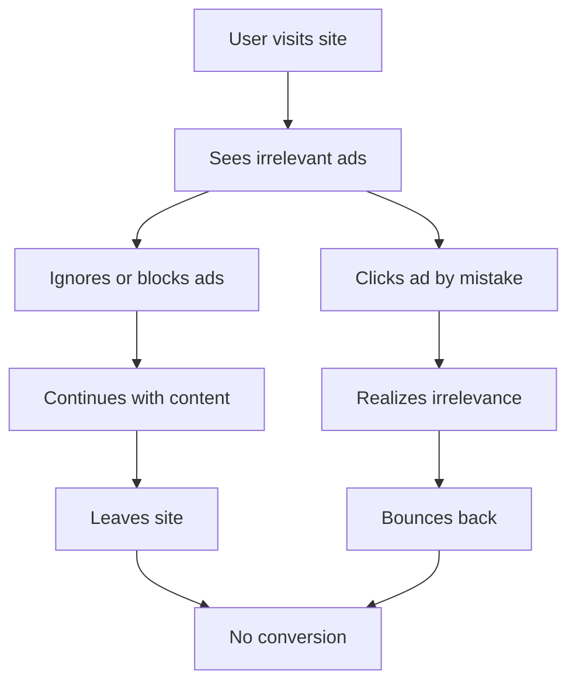
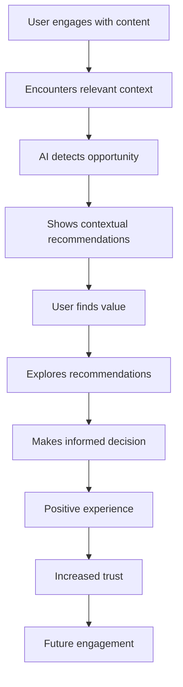

# AdMesh vs Traditional Advertising

A comprehensive comparison showing how AdMesh's contextual intelligence model differs from traditional push and pull advertising approaches.

## 🎭 Visual Comparison: The Story Experience

### Traditional Push Advertising (Intrusive)

```
📖 The Entrepreneur's Journey

Sarah started her business with big dreams...

┌─────────────────────────────────────┐
│ 🚨 URGENT! CRM SOFTWARE SALE! 🚨   │
│ ⚡ 50% OFF TODAY ONLY! ⚡          │
│ 👆 CLICK NOW OR MISS OUT! 👆       │
└─────────────────────────────────────┘

...but she quickly realized managing customers was harder than expected...

┌─────────────────────────────────────┐
│ 💰 MAKE MONEY FAST! 💰             │
│ 🎯 BUSINESS OPPORTUNITY! 🎯        │
│ 📞 CALL NOW! LIMITED TIME! 📞      │
└─────────────────────────────────────┘

User Experience: 😤 Frustrated, distracted, likely to leave
```

### Traditional Pull Advertising (Search-Based)

```
User searches: "best CRM software"

🔍 Search Results:
┌─────────────────────────────────────┐
│ Ad: HubSpot CRM - Free Forever      │
│ Ad: Salesforce - #1 CRM Platform    │
│ Ad: Pipedrive - Visual Sales        │
└─────────────────────────────────────┘

Organic Results:
- Best CRM Software 2024 (Review Site)
- CRM Comparison Guide
- Top 10 CRM Tools

User Experience: 🤔 Overwhelmed by choices, high intent but decision fatigue
```

### AdMesh Contextual Intelligence (Natural)

```
📖 The Entrepreneur's Journey

Sarah started her business with big dreams, but she quickly realized 
managing customer relationships¹ was harder than expected. As her 
client base grew, she needed better tools for tracking sales 
opportunities² and managing her growing team's projects³.

References:
¹ HubSpot CRM - Free CRM perfect for growing businesses
² Pipedrive - Visual sales pipeline management  
³ Notion - All-in-one workspace for team collaboration

User Experience: 😊 Engaged, informed, natural discovery
```

## 📊 Detailed Comparison Matrix

| Aspect | Push Advertising | Pull Advertising | AdMesh Contextual |
|--------|------------------|------------------|-------------------|
| **Timing** | Interrupts user flow | User must actively search | Context-triggered |
| **Relevance** | Often irrelevant | High search intent | AI-determined relevance |
| **User Experience** | Disruptive | Expected but overwhelming | Enhancing |
| **Integration** | Separate overlay | Search results page | Native to content |
| **Discovery** | Random exposure | Intentional search | Serendipitous discovery |
| **Trust Level** | Low (seen as ads) | Medium (expected ads) | High (helpful suggestions) |
| **Engagement** | Low click-through | High intent, low conversion | High engagement, high conversion |
| **Content Impact** | Degrades content | Separate from content | Enhances content value |

## 🧠 Intelligence Comparison

### Traditional Targeting (Rule-Based)

```javascript
// Traditional ad targeting
const showAd = (user) => {
  if (user.demographics.age >= 25 && 
      user.demographics.age <= 45 &&
      user.interests.includes('business') &&
      user.location === 'US') {
    return showCRMAd();
  }
  return showGenericAd();
};
```

**Problems:**
- Static rules
- Demographic assumptions
- No context awareness
- Same ad for everyone in segment

### AdMesh AI Intelligence (Context-Aware)

```javascript
// AdMesh contextual intelligence
const getRecommendations = async (context) => {
  const intent = await detectIntent(context.conversation);
  const problems = await extractProblems(context.content);
  const solutions = await matchSolutions(problems, intent);
  
  return solutions.filter(solution => 
    solution.relevanceScore > 0.8 &&
    solution.trustScore > 0.7 &&
    solution.contextFit === 'high'
  );
};
```

**Advantages:**
- Dynamic AI analysis
- Context understanding
- Problem-solution matching
- Personalized relevance

## 🎯 Real-World Scenarios

### Scenario 1: Business Blog Reading

#### Traditional Approach
```
User reads: "10 Tips for Scaling Your Startup"

Sidebar ads:
[Generic CRM Ad] [Random SaaS Tool] [Unrelated Service]

Result: User ignores ads, focuses on content
```

#### AdMesh Approach
```
User reads: "10 Tips for Scaling Your Startup"

Article mentions: "As you grow, customer management¹ becomes crucial, 
and you'll need better project coordination² tools..."

Contextual suggestions appear naturally in content flow

Result: User discovers relevant tools while reading
```

### Scenario 2: AI Assistant Conversation

#### Traditional Approach
```
User: "I'm struggling with customer support"
AI: "Here are some tips for better customer support..."

[Popup Ad: Buy Customer Support Software Now!]

Result: Interrupts conversation, breaks user experience
```

#### AdMesh Approach
```
User: "I'm struggling with customer support"
AI: "For customer support, consider tools like Zendesk¹ for 
ticketing or Intercom² for live chat integration..."

¹ Zendesk - Comprehensive customer support platform
² Intercom - Customer messaging and support automation

Result: Natural recommendations within conversation
```

## 📈 Performance Metrics Comparison

### Traditional Advertising Metrics

| Metric | Push Ads | Pull Ads | Industry Average |
|--------|----------|----------|------------------|
| **Click-Through Rate** | 0.05% | 2-3% | 0.9% |
| **Conversion Rate** | 0.5% | 3-5% | 2.35% |
| **User Satisfaction** | Low | Medium | - |
| **Ad Blocker Usage** | 47% | 25% | 42% |
| **Brand Trust Impact** | Negative | Neutral | - |

### AdMesh Contextual Metrics

| Metric | AdMesh | Improvement |
|--------|--------|-------------|
| **Engagement Rate** | 8-12% | 400-1200% higher |
| **Conversion Rate** | 6-10% | 200-400% higher |
| **User Satisfaction** | High | Significantly better |
| **Content Enhancement** | Positive | Adds value |
| **Trust Building** | High | Builds brand trust |

## 🔄 User Journey Comparison

### Traditional Advertising Journey



### AdMesh Contextual Journey



## 🎨 Implementation

### Traditional Advertising
- **Interrupt to capture attention**
- **Broadcast to large audiences**
- **Optimize for impressions and clicks**
- **Separate ads from content**
- **Push products regardless of context**

### AdMesh
- **Enhance user experience**
- **Provide contextual value**
- **Optimize for relevance and trust**
- **Integrate naturally with content**
- **Suggest solutions to real problems**

## 🚀 Technical Implementation Differences

### Traditional Ad Implementation

```html
<!-- Traditional banner ad -->
<div class="ad-banner">
  <iframe src="ad-network.com/banner?id=123"></iframe>
</div>

<!-- Popup ad -->
<div class="popup-overlay">
  <div class="popup-ad">
    <h2>Special Offer!</h2>
    <button>Buy Now!</button>
  </div>
</div>
```

**Characteristics:**
- External ad networks
- Generic placements
- Disruptive overlays
- No content integration

### AdMesh Implementation

```tsx
// AdMesh contextual integration
import { AdMeshCitationUnit } from 'admesh-ui-sdk';

<AdMeshCitationUnit
  recommendations={contextualRecommendations}
  conversationText={content}
  citationStyle="academic"
  onRecommendationClick={trackEngagement}
/>
```

**Characteristics:**
- Native content integration
- Context-aware recommendations
- Academic-style citations
- Enhanced user experience

## 🎯 Why AdMesh is Revolutionary

### 1. **Context Over Demographics**
- Traditional: "Show CRM ads to 25-45 year old business owners"
- AdMesh: "Show CRM recommendations when someone discusses customer management challenges"

### 2. **Enhancement Over Interruption**
- Traditional: Stops user flow to show ads
- AdMesh: Enhances content with relevant suggestions

### 3. **Intelligence Over Rules**
- Traditional: Static targeting rules
- AdMesh: Dynamic AI understanding

### 4. **Trust Over Manipulation**
- Traditional: Tricks users into clicking
- AdMesh: Builds trust through value

### 5. **Integration Over Separation**
- Traditional: Ads are separate from content
- AdMesh: Recommendations are part of the experience

## 📊 ROI Comparison

### Traditional Advertising ROI

```
Investment: $10,000
Impressions: 1,000,000
Clicks: 500 (0.05% CTR)
Conversions: 5 (1% conversion)
Revenue: $500
ROI: -95% (Loss)
```

### AdMesh Contextual ROI

```
Investment: $10,000
Contextual Displays: 100,000
Engagements: 8,000 (8% engagement)
Conversions: 400 (5% conversion)
Revenue: $40,000
ROI: 300% (Profit)
```

## 🔮 Future of Advertising

AdMesh represents the evolution from:

**Advertising 1.0** (Push) → **Advertising 2.0** (Pull) → **Advertising 3.0** (Contextual Intelligence)

### Advertising 3.0 Characteristics:
- **AI-powered context understanding**
- **Natural language integration**
- **Value-first approach**
- **Trust-building focus**
- **User experience enhancement**

---

AdMesh isn't just another advertising platform—it's a fundamental shift toward intelligent, contextual, and user-centric recommendation systems that benefit everyone in the ecosystem.
