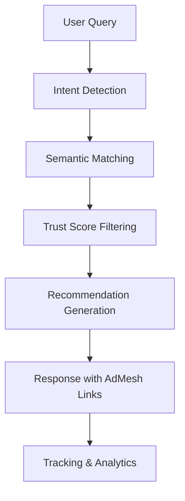

# Overview

This guide provides technical overview and core concepts for integrating AdMesh AI-powered product recommendation capabilities into enterprise applications.

## What is AdMesh?

AdMesh is an enterprise recommendation engine designed for AI applications, conversational interfaces, and modern web platforms. The system uses machine learning algorithms to analyze user intent and deliver contextually relevant product recommendations.

## Core Concepts

### Intent Detection
AdMesh analyzes user queries to categorize intent types:

- **compare_products** - Comparative analysis requests
- **best_for_use_case** - Scenario-specific recommendations
- **trial_demo** - Product evaluation inquiries
- **budget_conscious** - Cost-optimized suggestions

### Semantic Matching
The recommendation engine implements:
- **Text embeddings** using OpenAI's text-embedding-3-small model
- **Cosine similarity** algorithms for semantic matching
- **Trust scores** for quality assurance
- **Keyword matching** for precision targeting

### Recommendation Scoring
Each recommendation provides:
- **Intent match score** (0-1) - Query relevance measurement
- **Trust score** - Quality and reliability metrics
- **Reason** - AI-generated recommendation rationale

## Architecture Overview



## SDK Ecosystem

### Backend SDKs
- **Python SDK** - For AI applications, data processing, and backend services
- **TypeScript SDK** - For Node.js applications and serverless functions

### Frontend SDK
- **UI SDK** - React components for displaying recommendations with built-in tracking

## Integration Patterns

### AI Assistant Integration
Implementation for conversational interfaces and AI assistants:

```python
# Intent detection and recommendation retrieval
response = client.recommend.get_recommendations(
    query="Enterprise CRM solution requirements",
    format="auto"
)

# Process recommendations for chat interface
for rec in response.response.recommendations:
    print(f"Recommendation: {rec.title} - {rec.reason}")
```

### E-commerce Integration
Product discovery enhancement for e-commerce platforms:

```typescript
// User behavior-based recommendations
const recommendations = await client.recommend.getRecommendations({
  query: userQuery,
  format: 'auto'
});

// UI component integration
<AdMeshLayout recommendations={recommendations} />
```

### Content-Based Integration
Contextual product recommendations for content platforms:

```tsx
// Citation-based recommendation display
<AdMeshCitationUnit
  recommendations={recommendations}
  conversationText="For project management solutions..."
  citationStyle="numbered"
/>
```

## Key Features

### AI-First Architecture
- Purpose-built for AI applications
- Advanced intent detection algorithms
- Contextual analysis capabilities
- Natural language processing integration

### UI Component Library
- Production-ready React components
- Citation-based conversational interfaces
- Floating chat widget implementations
- Sidebar component options
- Automated recommendation widgets

### Analytics and Tracking
- Automated view tracking
- Click-through rate monitoring
- Conversion attribution
- Revenue analytics

### Customization Options
- Light and dark theme support
- Custom accent color configuration
- Responsive design implementation
- Accessibility compliance

## Implementation Checklist

- [ ] Register account at [useadmesh.com/agent](https://useadmesh.com/agent)
- [ ] Obtain API credentials from dashboard
- [ ] Select appropriate SDK (Python or UI)
- [ ] Install SDK in development environment
- [ ] Execute initial API integration
- [ ] Implement recommendation display
- [ ] Configure tracking and analytics

## Next Steps

1. **[Configure API Authentication](/getting-started/api-keys)** - Set up credentials
2. **[Quick Start Implementation](/getting-started/quick-start)** - Execute first API call
3. **SDK Selection**:
   - [Python SDK](/python-sdk/installation) for backend applications
   - [UI SDK](/ui-sdk/installation) for React frontend components

## Use Cases

### AI Conversational Interfaces
Product recommendation integration for conversational systems:
- Customer support automation
- Shopping assistance platforms
- Business advisory systems

### E-commerce Platforms
Product discovery and conversion optimization:
- Recommendation engine implementation
- Search result enhancement
- Personalized user experiences

### Content Platforms
Contextual product suggestion integration:
- Editorial content recommendations
- Tutorial tool suggestions
- Review platform integrations

### SaaS Applications
Tool discovery and optimization:
- Workflow optimization recommendations
- Integration suggestions
- Feature discovery systems

---

Begin implementation by [configuring API authentication](/getting-started/api-keys) and executing your first recommendation request.
